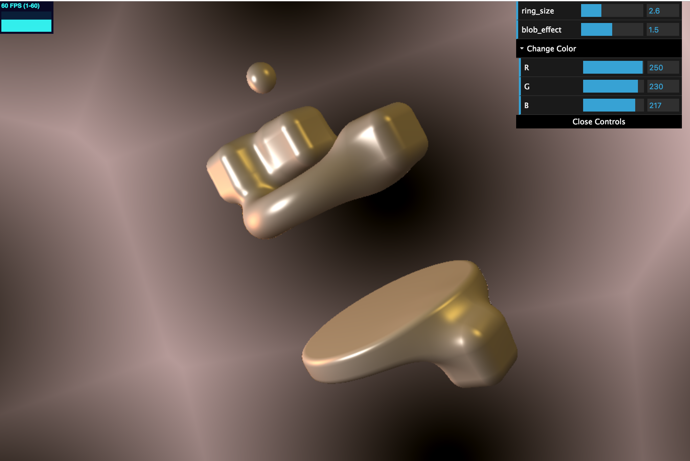
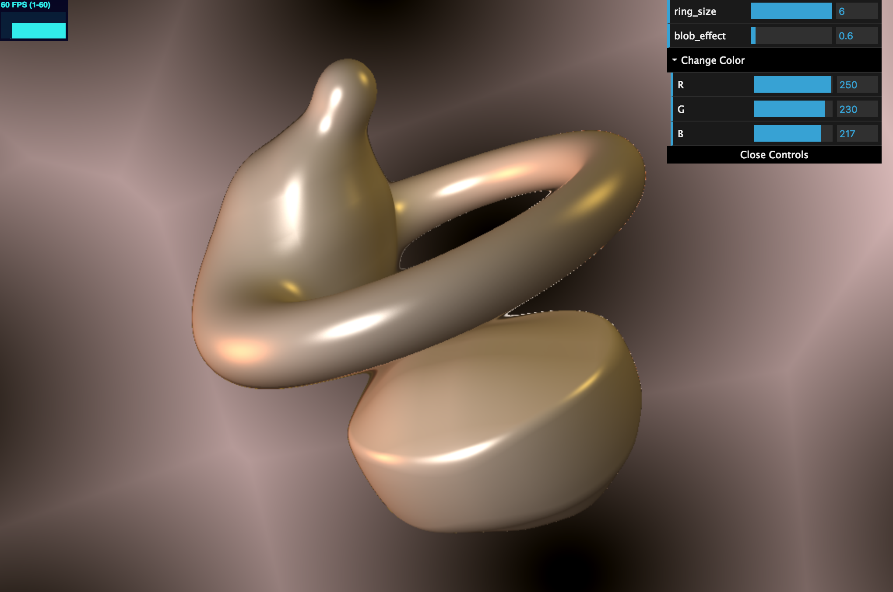

#Implicit Surfaces

### Chloe Le
- https://chloele.com/

###Demo: 
- http://www.chloele.com/implicit-surfaces/

Adjust the ring size, blob, and background color in the top right corner.

 

##References

I referenced articles on metaballs to create the blob-like effect:
https://en.wikipedia.org/wiki/Metaballs
http://paulbourke.net/geometry/implicitsurf/index.html

For SDF functions and SDF normal calculations, I referenced Inigo Quilez:
http://www.iquilezles.org/www/articles/distfunctions/distfunctions.htm
http://iquilezles.org/www/articles/normalsSDF/normalsSDF.htm

For ray casting and ray marching, I referenced [slides](https://docs.google.com/presentation/d/e/2PACX-1vSN5ntJISgdOXOSNyoHimSVKblnPnL-Nywd6aRPI-XPucX9CeqzIEGTjFTwvmjYUgCglTqgvyP1CpxZ/pub?start=false&loop=false&delayms=60000&slide=id.g27215b64c6_0_107
) from UPenn's CIS460/560 course.

## Inspiration
In class, we were shown a demo of red glass metaballs. I found that really intriguing, so I wish to re-create something similar with the blob effect. 

## Implementation

###Scene Geometry
The scene is composed of SDFs such as sphere, round cube, and torus. The bottom plate-like flat cylinder is created by performing an intersection and then a smooth operation. The blob SDF consists of functions with exp and log (details linked in the reference section). The coefficient b in the blob function can be changed by the user to make the SDFs more/less sticky. 

###Optimization
Raymarch optimization is done by using bounding cubes arranged in a Bounding Volume Hierarchy. The bounding cubes are of struct Cube, and there are five total to form the parent-child relationships. Each of the bounding cubes consists of a min and max vec3. When testing for ray-cube intersection, I test against all x - y - z directions of the cube, and see if our ray casted hits the bounding cube. If so, we coutinue the ray march, else, we stop and assume the ray does not hit anything.

Since scene geometry is blended in a blob and constantly evolving, the bounding boxes are not as tight on some shapes like the meta-cubes. 

###Animation
In the scene, cubes and the sphere are animated with u_Time (the cubes change position and sphere changes scale) , and the background texture is animate with a subtle expansion/contraction movement. 

###Functions Used for Animation
I used smoothstep for the "pumping" of the sphere, and a bunch of cosine and sine waves to create the smooth movement of the the cubes. I have the tirangle wave function in the code, and have tested cube movements using the triangle wave. However, I think the blob effect looks more nice with a smoother-movement, so I commented out the usage of the triangle-wave function. 

###Texturing
Texturing of the background is procedurally done using the Worley and FBM noise functions. I created a background color and a highlight color, then, I computed a texture map using the noise functions and calculated the background using 1.0-texture. 

###Shading with Surface Normal Computation
Surface normal computation of the SDF is done by using the forward and central differences technique. 
This technique uses an offset in the positions directional components and normalize all components. 
The lighting/shading of the surfaces uses a mix of ambient, diffuse, and phong. We pass in the light direction, color, the point, and ray direction to compute the corresponding light from the three. 
I used a total of three lights in the scene. 
